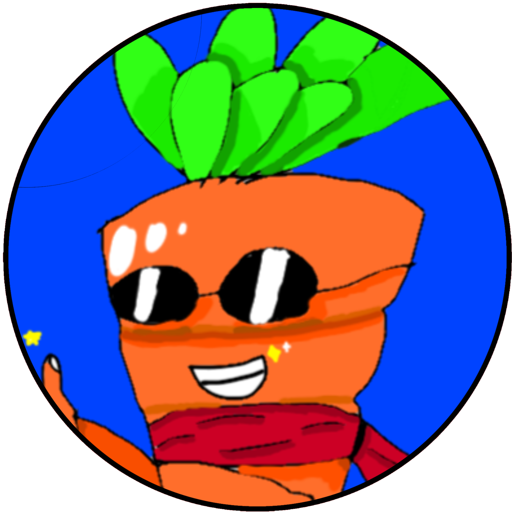
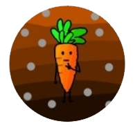
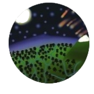
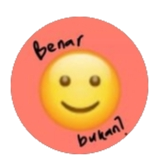
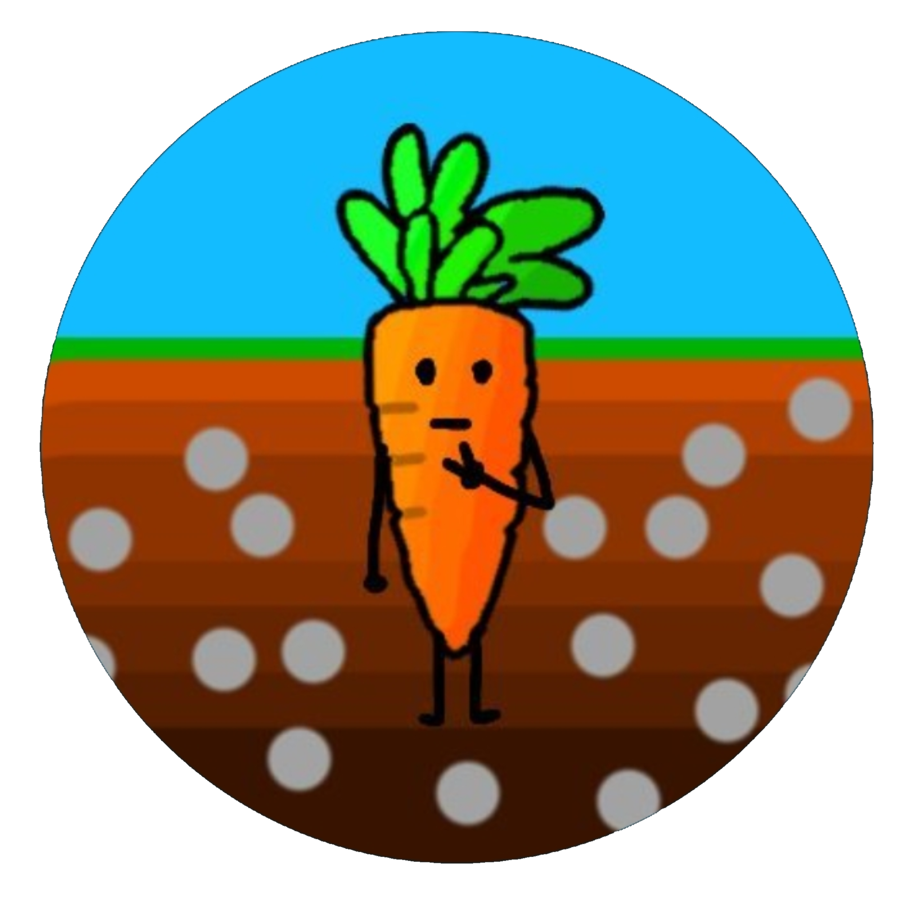
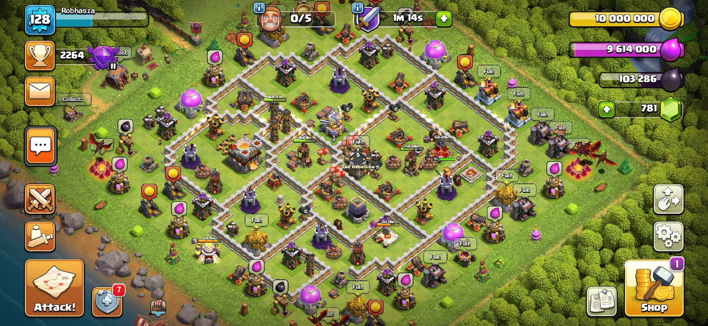
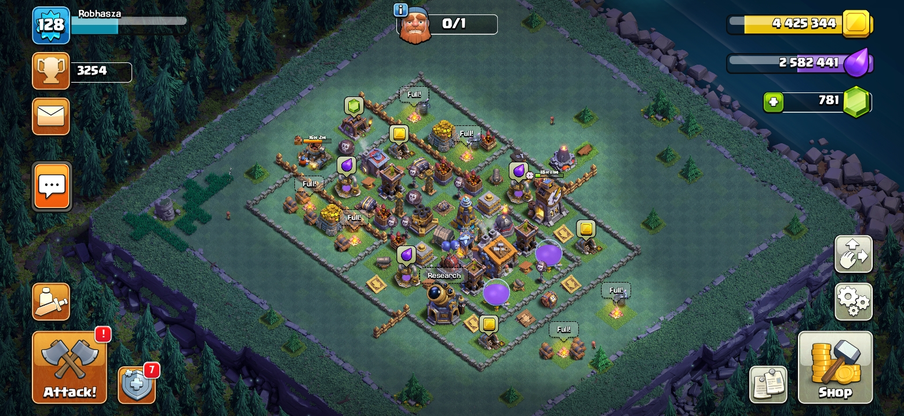
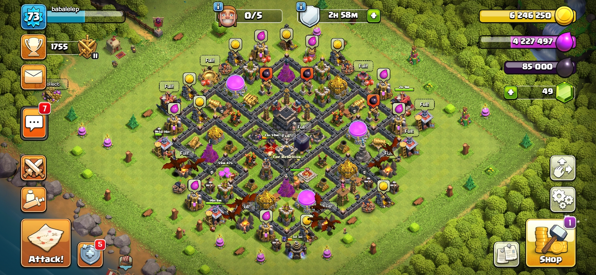
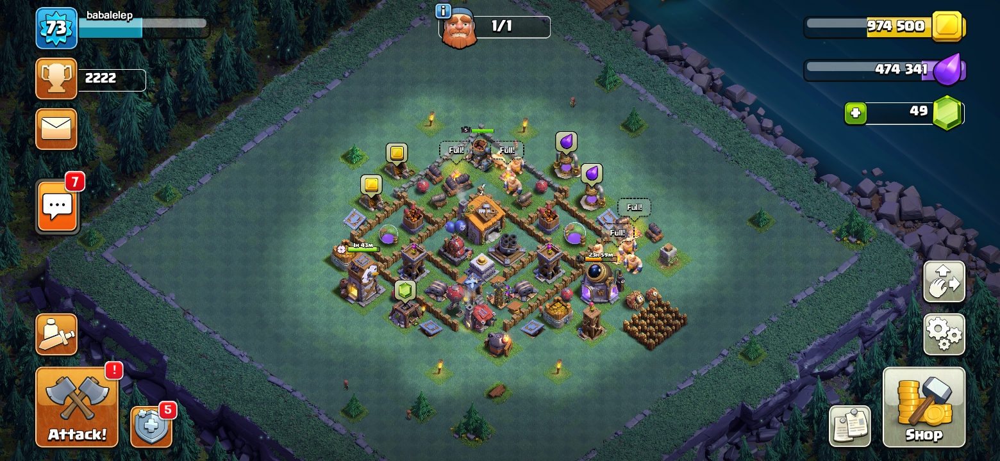
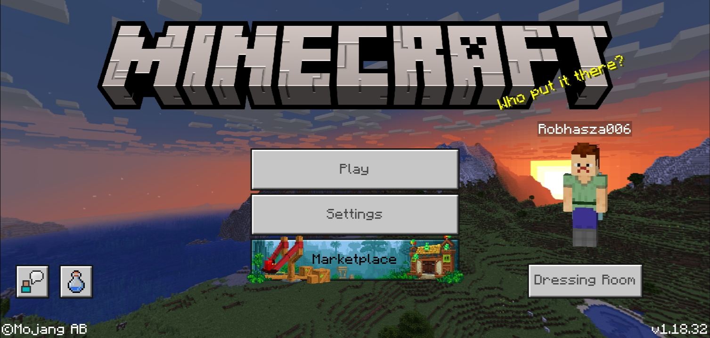

# Umbiwortelker.github.io
<!DOCTYPE html>
<html>
<head>
	<meta charset="utf-8">
	<meta name="viewport" content="width=device-width, initial-scale=1">
	<title>Umbiwortelker Official</title>
	<link rel="shortcut icon" href="profil.png.png">
	<link rel="stylesheet" type="text/css" href="style.css">
	body {
	font: 20px/20px arial, sans-serif;
	color: gray;
	text-transform: capitalize;
	background-color: #512300;
	margin: 0;
}
.pala {
	
}
h1 {
	color: black;
	padding: 50px 30px;
	background-color: skyblue;
	margin: 0;
	border-bottom-color: forestgreen;
	border-bottom-style: solid;
	border-bottom-width: 10px;
}
.pala img {
	margin-top: -60px;
	margin-right: 50px;
	float: right;
}
.pala h3 {
	padding: 5px 30px;
}
.pala ul {
	padding-left: 50px;
	margin-top: -20px;
}
.pala ul li a {
	text-decoration: none;
	color: gray;
}
.pala ul li a:hover {
	background-color: lightblue;
	color: white;
}
.isi {
	
	background-color: #471e00;
	padding-top: 5px;
	margin: 0;
}
.nama {
	padding-left: 30px;
	padding-bottom: 15px;
}
.medsos {
	background-color: #3f1800;
	padding-left: 30px;
	padding-top: 5px;
	padding-bottom: 15px;
}
.main {
	background-color: #331600;
	padding-left: 30px;
	padding-top: 5px;
	padding-bottom: 15px;
}
#krft {
	padding-left: 35px;
}
.ska {
	background-color: #261000;
	padding-left: 30px;
	padding-top: 5px;
	padding-bottom: 15px;
}
.ska p a {
	color: #261000;
	text-decoration: none;
}
.ska p a:hover {
	color: forestgreen;
	background-color: white;
}
img {
 margin-top: 15px;
}
button {
	color: grey;
}

.cf:before,
.cf:after {
    content: " "; /* 1 */
    display: table; /* 2 */
}

.cf:after {
    clear: both;
}

.cf {
    *zoom: 1;
</head>
<body>
	
<h1>Umbiwortelker/Robhasza</h1>

<h3>Daftar isi</h3>
<ul>
	<li><a href="#nama">biodata</a></li>
	<li><a href="#akun">medsos</a></li>
	<li><a href="#main">game</a></li>
	<li><a href="#suka">hobi</a></li>
</ul>

	
<h3 id="nama">biodata</h3>
<table>
	<tr>
		<td>Nama asli :</td>
		<td>Ilham Habibie Zaini</td>
	</tr>
	<tr>
		<td>Usia :</td>
		<td>15 Tahun</td>
	</tr>
	<tr>
		<td>Kelahiran :</td>
		<td>6 November 2006</td>
	</tr>
	<tr>
		<td>Nama lain :</td>
		<td>Umbiwortelker dan Robhasza</td>
	</tr>
</table>

	

<h3 id="akun">Media Sosial</h3>
<h4>A. Instagram</h4>
<table>
	<tr>
		<td><a href="https://www.instagram.com/umbiwortelker/" target="_blank"> <label>Umbiwortelker</label></a></td>
		<td><a href="https://www.instagram.com/iamz.iz/" target="_blank"> <label>Iamz.iz</label></a></td>
		<td><a href="https://www.instagram.com/benar_bukan/" target="_blank"> <label>benar_bukan(mati)</label></a></td>
	</tr>
</table>
<h4>B. Twitter</h4>
<table>
	<tr>
		<td><a href="https://www.twitter.com/umbiwortelker/" target="_blank"> <label>UmbiwortelKER</label></a></td>
	</tr>
</table>
<h4>C. Facebook</h4>
<table>
	<tr>
		<td><a href="https://www.facebook.com/profile.php?id=100078805011857" target="_blank"> <label>Umbiwortel Ker</label></a></td>
	</tr>
</table>

<h3 id="main">Game</h3>
<h4>1. Clash of Clans</h4>
<ul>
	<li>Robhasza    </li>
	 
	 
	<li>Babalelep    </li>
</ul>
<h4>2. Minecraft</h4>
 

<h3 id="suka">Hobi</h3>
<table>
	<tr>
		<td></td>
		<td></td>
		<td></td>
	</tr>
</table>

<a href="rahasia.html">
secret last page</a>

</body>
</html>
